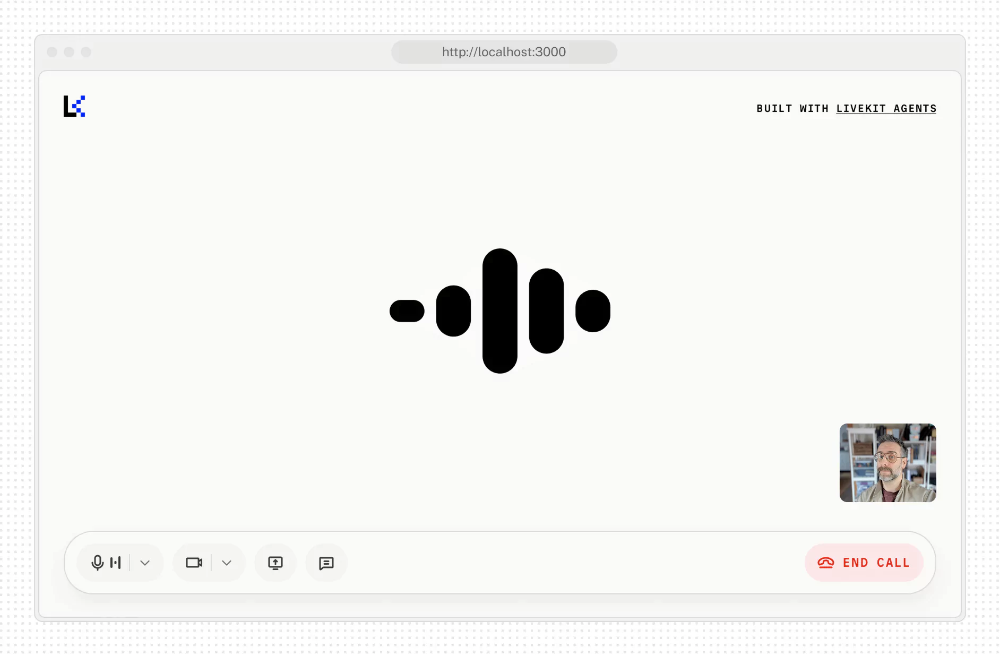

# Agent Starter for React

This is a starter template for [LiveKit Agents](https://docs.livekit.io/agents) that provides a simple voice interface using the [LiveKit JavaScript SDK](https://github.com/livekit/client-sdk-js). It supports [voice](https://docs.livekit.io/agents/start/voice-ai), [transcriptions](https://docs.livekit.io/agents/build/text/), and [virtual avatars](https://docs.livekit.io/agents/integrations/avatar).

Also available for:
[Android](https://github.com/livekit-examples/agent-starter-android) • [Flutter](https://github.com/livekit-examples/agent-starter-flutter) • [Swift](https://github.com/livekit-examples/agent-starter-swift) • [React Native](https://github.com/livekit-examples/agent-starter-react-native)

<picture>
  <source srcset="./.github/assets/readme-hero-dark.webp" media="(prefers-color-scheme: dark)">
  <source srcset="./.github/assets/readme-hero-light.webp" media="(prefers-color-scheme: light)">
  
</picture>

### Features:

- Real-time voice interaction with LiveKit Agents
- Camera video streaming support
- Screen sharing capabilities
- Audio visualization and level monitoring
- Virtual avatar integration
- Light/dark theme switching with system preference detection
- Customizable branding, colors, and UI text via configuration

This template is built with Next.js and is free for you to use or modify as you see fit.

### Project structure

```
agent-starter-react/
├── app/
│   ├── (app)/
│   ├── api/
│   ├── ui/
│   └── layout.tsx
├── components/
│   ├── app/
│   ├── livekit/
│   └── ...
├── hooks/
├── lib/
├── public/
├── styles/
│   └── globals.css
└── package.json
```

## Getting started

> [!TIP]
> If you'd like to try this application without modification, you can deploy an instance in just a few clicks with [LiveKit Cloud Sandbox](https://cloud.livekit.io/projects/p_/sandbox/templates/agent-starter-react).

[](https://cloud.livekit.io/projects/p_/sandbox/templates/agent-starter-react)

Run the following command to automatically clone this template.

```bash
lk app create --template agent-starter-react
```

For integrated LexVoice runs, configure the LexVoice repository `.env` and start
the frontend through the LexVoice runtime scripts. The LexVoice repository's
`run.sh` injects LiveKit, room-input, input-source, role-device, agent, media,
and debug settings into this Next.js process.

The session lifecycle API keeps start/stop state in memory, so integrated
deployments should route `/api/session/*` to a single Next.js instance or sticky routing.
If you replace the custom connection details endpoint, it must echo the requested
`sessionId` and derive the same room name so dispatch and stop calls coordinate
with the connected room.

### LiveAvatar Gateway Deployments

Sandbox-backed public deployments are owned by the LexVoice repository. Set
`LIVEAVATAR_USE_SANDBOX=1` in the LexVoice repository `.env` and configure
broker, template, warm pool, and `SANDBOX_ENV_*` values in the LexVoice repository's
`deploy/liveavatar_gateway/.env`.

This frontend repository only runs the Next.js UI. It does not create, release,
or warm sandbox sessions.

For standalone frontend development, install dependencies and run the dev
server directly:

```bash
pnpm install
pnpm dev
```

And open http://localhost:3000 in your browser.

You'll also need a LiveKit server and an agent worker. In integrated workspaces,
those are normally provided by the LexVoice project.

## Configuration

This starter is designed to be flexible so you can adapt it to your specific agent use case. You can easily configure it to work with different types of inputs and outputs:

#### Example: App configuration (`app-config.ts`)

```ts
export const APP_CONFIG_DEFAULTS: AppConfig = {
  companyName: 'LiveKit',
  pageTitle: 'LiveKit Voice Agent',
  pageDescription: 'A voice agent built with LiveKit',

  supportsChatInput: true,
  supportsVideoInput: true,
  supportsScreenShare: true,
  isPreConnectBufferEnabled: true,

  logo: '/lk-logo.svg',
  accent: '#002cf2',
  logoDark: '/lk-logo-dark.svg',
  accentDark: '#1fd5f9',
  startButtonText: 'Start call',

  // for LiveKit Cloud Sandbox
  sandboxId: undefined,
  agentName: undefined,
};
```

You can update these values in [`app-config.ts`](./app-config.ts) to customize branding, features, and UI text for your deployment.

> [!NOTE]
> The `sandboxId` and `agentName` are for the LiveKit Cloud Sandbox environment.
> They are not used for local development.

#### Environment Variables

Integrated runs should keep runtime variables in the LexVoice repository `.env`; this
repository's `.env.example` is documentation-only. Only create
`agent-starter-react/.env.local` for standalone frontend development launched
directly with `pnpm dev`.

```env
LIVEKIT_API_KEY=your_livekit_api_key
LIVEKIT_API_SECRET=your_livekit_api_secret
LIVEKIT_URL=https://your-livekit-server-url
```

The frontend defaults to the browser camera/microphone input when no input
source is provided. Configure `INPUT_SOURCE` only in the LexVoice repository `.env` for
integrated backend runs. The LiveKit variables above are required for
standalone voice agent functionality to work with your LiveKit project.

When `AGENT_NAME` is unset, the frontend derives the dispatch target from the
input source as `lexvoice-${INPUT_SOURCE}-agent`; an explicit `AGENT_NAME`
always wins. Standalone deployments that do not run a matching agent worker
should set `AGENT_NAME` to the worker name they expect to dispatch.

Vision-related frontend variables use the `*_VISION_*` names. The older
`*_VIDEO_*` names are still accepted as migration fallbacks, but new
configuration should use the current names:

| Current name                         | Legacy fallback                     |
| ------------------------------------ | ----------------------------------- |
| `BROWSER_VISION_WIDTH`               | `BROWSER_VIDEO_WIDTH`               |
| `BROWSER_VISION_HEIGHT`              | `BROWSER_VIDEO_HEIGHT`              |
| `BROWSER_VISION_FPS`                 | `BROWSER_VIDEO_FPS`                 |
| `BROWSER_VISION_MAX_BITRATE`         | `BROWSER_VIDEO_MAX_BITRATE`         |
| `BROWSER_VISION_STATS`               | `BROWSER_VIDEO_STATS`               |
| `REMOTE_VISION_WIDTH`                | `REMOTE_VIDEO_WIDTH`                |
| `REMOTE_VISION_HEIGHT`               | `REMOTE_VIDEO_HEIGHT`               |
| `REMOTE_VISION_FPS`                  | `REMOTE_VIDEO_FPS`                  |
| `DEBUG_VISION`                       | `DEBUG_VIDEO`                       |
| `NEXT_PUBLIC_ROOM_VISION_TRACK_NAME` | `NEXT_PUBLIC_ROOM_VIDEO_TRACK_NAME` |

## Contributing

This template is open source and we welcome contributions! Please open a PR or issue through GitHub, and don't forget to join us in the [LiveKit Community Slack](https://livekit.io/join-slack)!
